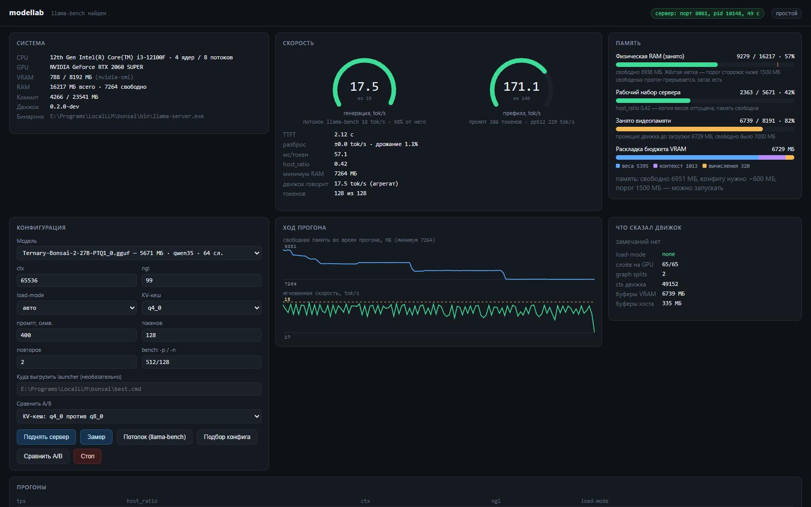
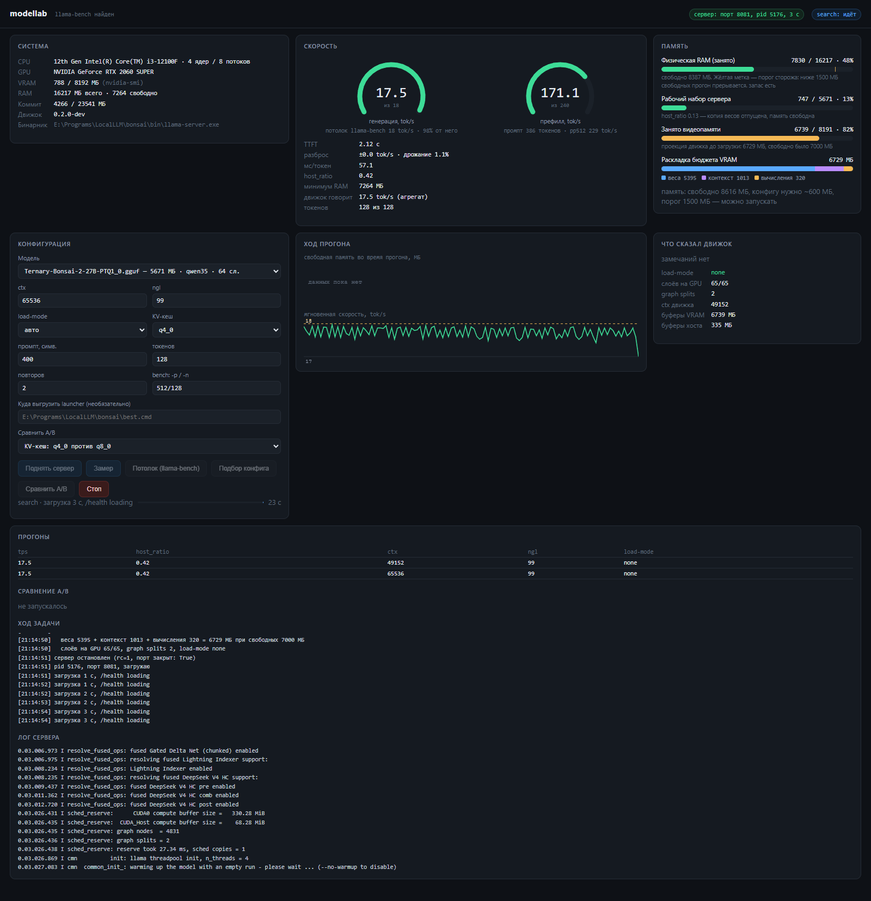

# Wedns: ModelLab

Пульт для локальных LLM на слабом железе: измеряет скорость и память одним прогоном,
подбирает контекст, который влезает в видеопамять целиком, и сравнивает конфигурации
прогонами вперемешку - потому что одиночное сравнение на этой машине измеряет шум,
а не эффект.



Только стандартная библиотека Python 3.9+. Ни установки, ни зависимостей, ни Electron:
интерфейс - один HTML-файл, отдаваемый `http.server`. Приложение измеряет свободную
память, поэтому браузерный рантайм на сотни мегабайт попал бы в тот же бюджет, который
оно измеряет. `http.server` плюс страница стоят около 15 МБ.

---

## Запуск

### Требования

- **Python 3.9+** (стандартная библиотека, без `pip install`)
- **llama-server** - бинарник из [llama.cpp](https://github.com/ggerganov/llama.cpp)
  или сборки LM Studio / Bionic. Должен быть в `PATH`, либо путь прописан в переменной
  `LLAMA_SERVER`, либо лежит в известном месте (бэкенд LM Studio и т.д.)
- **NVIDIA GPU** - используется `nvidia-smi` для замера VRAM
- **GGUF-модели** - каталог с файлами `.gguf`

### ModelLab (дашборд)

Открыть терминал в корне репозитория и запустить:

```
python -m modellab.gui
```

Дашборд откроется по адресу `http://127.0.0.1:8090`.

Дополнительные параметры:

```
python -m modellab.gui --open              # открыть браузер сразу
python -m modellab.gui --port 9000         # другой порт
python -m modellab.gui --models D:\gguf    # свой каталог моделей
python -m modellab.gui --host 0.0.0.0       # слушать все интерфейсы (по умолчанию 127.0.0.1)
```

Каталог моделей по умолчанию - тот, что прописан в `modellab/lab.py`; он переопределяется
ключом `--models` или переменной окружения `MODELLAB_MODELS`.

### Wednesday (проверка готовности модели)

```
python weds.py check      # полная диагностика одной командой
python weds.py doctor     # что вообще запущено
python weds.py tune       # подобрать параметры под железо (с бэкапом конфига)
python weds.py mcp        # поднять MCP-сервер, чтобы звать это из любого агента
```

---

## Зачем это отдельно от бенчмарков

На i3-12100 / 16 ГБ / RTX 2060 Super 8 ГБ узкое место - не скорость счёта, а память,
и вопрос стоит не «какая скорость», а «что вообще влезает». Отсюда три вещи, которых
нет в обычном бенчмарке.

**Подбор вместо перебора.** Одна загрузка модели стоит ~50 с холодной, а сетка по
контексту - это пять минут ради одной цифры. Расход VRAM от контекста линеен, поэтому
достаточно **двух** загрузок на разных `ctx`, чтобы получить прямую, и потолок считается
аналитически:

```
ctx_max = (свободно - веса - резерв - intercept) / наклон
```

Измерено на Ternary-Bonsai-2-27B (KV q4_0, flash-attn on): `260 + 0.0216·ctx` МБ,
наклон **22.1 МБ на 1024 токена**. Точки 49152 и 65536 в подгонке не участвовали и
проверяют её - ошибка 0.2 % и 0.6 %, то есть меньше резерва 256 МБ.

**A/B прогонами вперемешку.** Одна и та же конфигурация в соседних прогонах давала
**8.12 и 15.38 tok/s** - разброс в 1.9 раза. Он берётся из окружения, не из модели.
Поэтому варианты чередуются (A, B, A, B, …), сравниваются разности внутри пары, и знак
разности должен совпадать во всех парах. Если знак скачет - это тоже результат: различие
меньше шума.

**Память как первый класс.** Скорость и потребление меряются одним прогоном. Режим
загрузки выводится из числа слоёв, а не задаётся константой: на этой машине `mmap` дал
рабочий набор 6072 МБ и decode 9.87 tok/s, `--load-mode none` - 945 МБ и 17.90 tok/s.

---

## Защита от «уронил машину»

- `preflight` перед каждым стартом: пол свободной физической памяти, потребность конфига,
  commit и список процессов-потребителей. Отказ - с причиной и именами.
- `MemoryWatchdog` во время прогона по двум критериям: пик физической памяти приходится
  на загрузку, а исчерпание commit - это и есть настоящее «машина замерла».
- Одно тяжёлое задание за раз: две копии модели на одной карте дают цифры, которые
  нельзя сравнивать.
- Чужие процессы не убиваются. Однажды бенчмарк был прерван посторонним `llama-server` -
  он не был тронут, а приложение научили отказывать заранее с объяснением.

UI слушает только `127.0.0.1` и проверяет заголовок `Host`: иначе страница на любом сайте
могла бы обратиться к API по localhost (DNS rebinding) и запустить сервер на чужой
конфигурации.

---

## Что получилось на этой машине

```
llama-bench (потолок железа)   tg 17.83 tok/s   pp 229.42 tok/s

ctx 65536   буферы VRAM 7107 МБ   host_ratio 0.42   17.50 tok/s
ctx 49152   буферы VRAM 6739 МБ   host_ratio 0.417  17.53 tok/s   98.3 % потолка
```

Скорость в пределах шума, а видеопамять отличается на 368 МБ ровно и воспроизводимо.
Это и есть ответ: 65536 не даёт ничего сверх 49152, но оставляет меньше запаса -
поэтому рабочему лаунчеру нужен супервизор.

Подбор на текущем состоянии карты даёт 49152: при 7000 МБ свободных 65536 не влезает
(нужно ~7107 МБ). Движок при этом печатает `cannot meet free memory target of 1024 MiB`,
но загружается и работает - его проекция переоценивает расход примерно на 100 МБ,
поэтому резерв взят 256 МБ, а не 1024 МБ.



---

## Вторая половина: Wednesday

В репозитории лежит и вторая часть - `weds`, проверка локальной модели на готовность
к **агентской** работе, а не к болтовне в чате. Отвечает на вопросы, которые не видны
из UI: влезает ли системный промпт агента в контекст, умеет ли модель вызывать
инструменты, не ломается ли JSON в аргументах, кэшируется ли префикс.

Поводом стал реальный случай: модель подняли в LM Studio, агент ответил
`Custom model error. Please switch model or retry`, а в логе движка стояло
`request (37955 tokens) exceeds the available context size (32768 tokens)` -
системный промпт с описаниями инструментов оказался 37 955 токенов. Модель была ни при чём.

Подробности - в [`weds/README.md`](weds/README.md).

---

## Структура

| Путь                | Что там                                                               |
| ------------------- | --------------------------------------------------------------------- |
| `modellab/`         | Приложение: датчики, сторож, запуск `llama-server`, замер, подбор, UI |
| `weds/`             | Проверка готовности к агентской работе, `tune`, MCP-сервер            |
| `tests/`            | Прогоны: датчики, статика, выгрузка `.cmd`, приёмка через API         |
| `skills/wednesday/` | Скилл для агента                                                      |
| `docs/`             | Снимки экрана                                                         |

Подробное описание ModelLab - [`modellab/README.md`](modellab/README.md): там разобраны
ловушки, стоившие времени (обязательный `-lv 4`, `--load-mode` для `llama-bench`, кэш
префикса, подменяющий замер префилла, CRLF и ASCII в `.cmd` лаунчера, два написания путей
на Windows), и границы применимости.

---

## Тесты

```bash
python tests/smoke_probe.py       # датчики: 25 проверок на живом железе и реальном логе
python tests/smoke_core.py        # статика: конфиг, сторож, порт, двойник, профили
python tests/smoke_core.py --live # плюс живой прогон на модели 0.8B
python tests/smoke_export.py      # выгрузка .cmd и профили: 66 проверок
python tests/accept_api.py        # приёмка через API самого UI
```

`smoke_export.py` разбирает сгенерированный `.cmd` так, как его прочитал бы `cmd.exe`
(снимает `rem`, склеивает продолжения по каретке, подставляет `%переменные%`, разбирает
кавычки), и сверяет результат с `cfg.to_argv()`. Именно эта проверка поймала лаунчер
без исполняемого файла, без `-c` и с кавычками вокруг команды - файл создавался, был
непустой и выглядел правдоподобно.

Живой прогон на 27B через API интерфейса (`accept_api.py`) проходит целиком: замер,
старт сервера, подбор, остановка.

---

## Границы применимости

- **Потолок по контексту считается от свободной VRAM, а не от полной.** Часть карты
  занимает рабочий стол: 8191 МБ всего против 7000 МБ свободных в момент старта движка.
- **`nvidia-smi` и движок считают свободное по-разному**, расхождение достигает ~500 МБ.
  Поэтому профиль при переиспользовании сравнивает разность, а не абсолют.
- **Наибольший влезающий контекст - не максимум скорости.** 49152 выбран как компромисс.
- **`host_ratio` нельзя сравнивать между моделями разного размера** (у 0.8B он 1.65),
  только между режимами одной модели.
- **Профиль привязан к железу** и содержит абсолютные пути, поэтому в репозиторий
  не кладётся: файл создаётся сам при первом подборе.
- **Тесты и числа выше сняты на Windows** и на конкретной машине; пути к моделям в
  `tests/smoke_*.py` - её же. Прогоны `smoke_probe` и живой `smoke_core --live` без
  этих моделей не запустятся, статическая часть `smoke_core` и `smoke_export` - запустятся.
